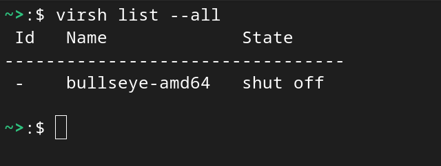
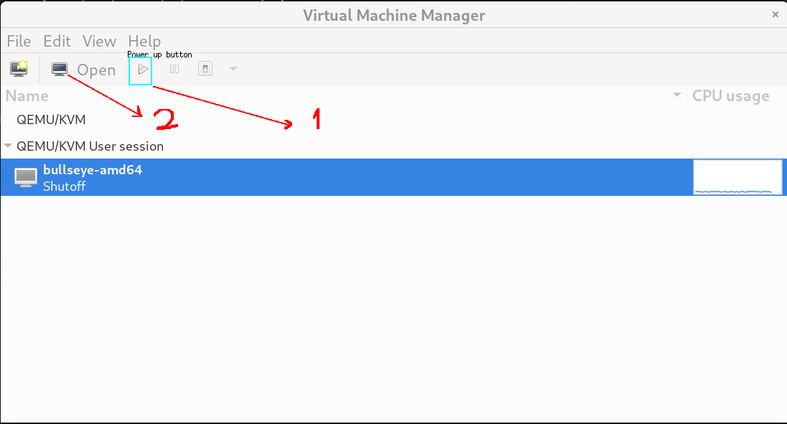
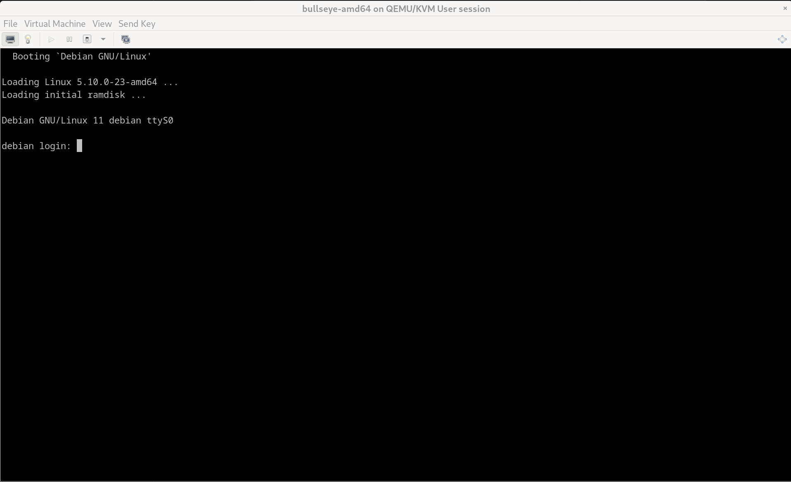

###  KVM ( Kernel Virtual Machine )


Kernel Virtual Machine or KVM is a virtualization solution for for linux, it contains loadable kernel
module kvm.ko , which provides the core virtualization infrastructure and a processor specific module 
kvm-intel.ko, or kvm-amd.ko.

## 1. Check for virtualization support in your system.

```
egrep -q 'vmx|svm' /proc/cpuinfo && echo yes || echo no
```

output should be yes ,  if not check your system bios and UEFI settings to enable virtualization.


## 2. Installation 

2.1. Install Qemu ( Quick Emulator) & Libvirt


```
sudo apt install --no-install-recommends qemu-system libvirt-clients libvirt-daemon-system
```


*qemu-system:* qemu (Quick Emulator) type 2 hypervisor & os emulator

*libvirt-clients:*  c toolkit to interact with kvm virtualization , it contains tools like libvirt, virsh and other client tools 

*libvirt-daemon-system:* contains the configuration files to run the libvirt daemon as a system service

2.2. Install virtinst & virt-manager , virt-viewer

```
sudo apt update && sudo apt install virtinst virt-manager
```

virtinst: command line utilities to create and edit virtual machines , like virt-install

virt-manager: virt-manager application is a GUI for managing virtual machines through libvirt

virt-viewer: display the graphical console of the vm.


## 3. Add user to libvirt group.

to manage virtual machines as a regular user , add user to libvirt group

```
sudo adduser <user-name> libvirt
```


test ,  to list virtual m/c  ( called domains )

```
virsh list --all
```

Below Sample output 



## 4. User Vs System vm's

by default virsh run as normal user connects to libvirt using qemu:///session string , this will list only vm's belong to this user 

to list system vm's  use 

qemu:///system  connect string

```
virsh --connect qemu:///system list --all
```


## 5. creating simple vm using virtinst.

```
virt-install --virt-type kvm --name bullseye-amd64 \
--location http://deb.debian.org/debian/dists/bullseye/main/installer-amd64/ \
--os-variant debian11 \
--disk size=10 --memory 1000 \
--graphics none \
--console pty,target_type=serial \
--extra-args "console=ttyS0"
```

above command will create a debian11 vm 

--name : name of the vm  
--virt-type : type of vm  
--os-variant   :  debian11  
--disk size=10   
--memory 1000MB   
--graphics none:  no graphics at install time  

--console pty,target_type=serial   
--extra-args "console=ttyS0"   : opens serial port for installation messages to show on terminal 

instead of using local image it downloads and installs from  --location


## 6. Using virt-manager to connect to vm

Launch Virtual Machine Manager gui 





select vm and click power on virtual machine button.(1)

and then  click on Open (2)

Sample VM Login screen


