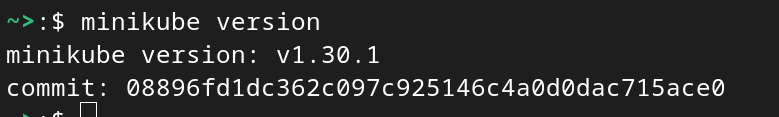
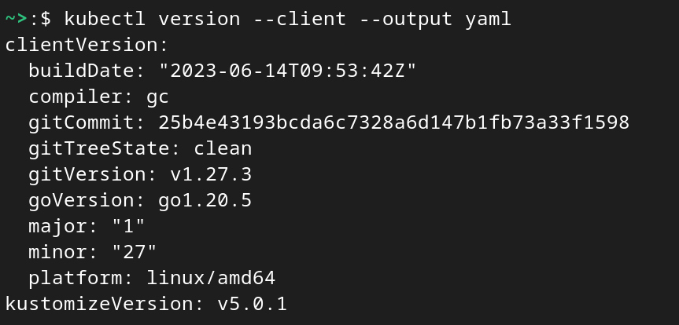
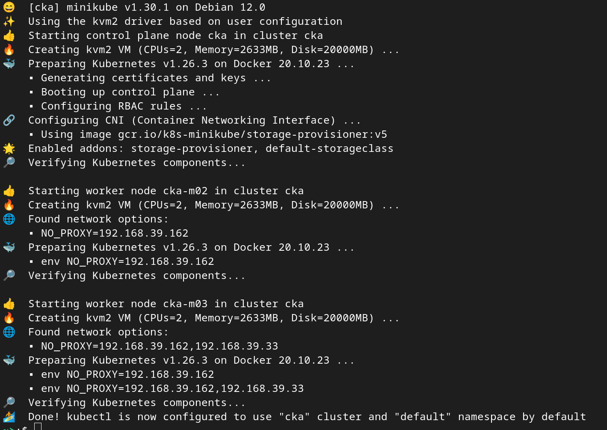
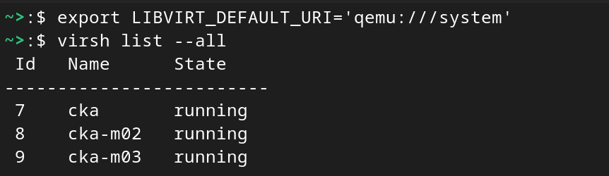
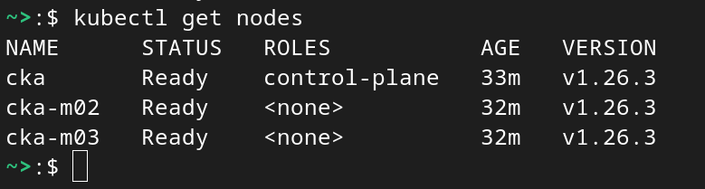
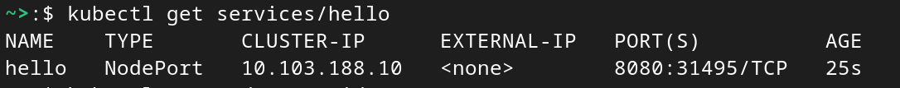
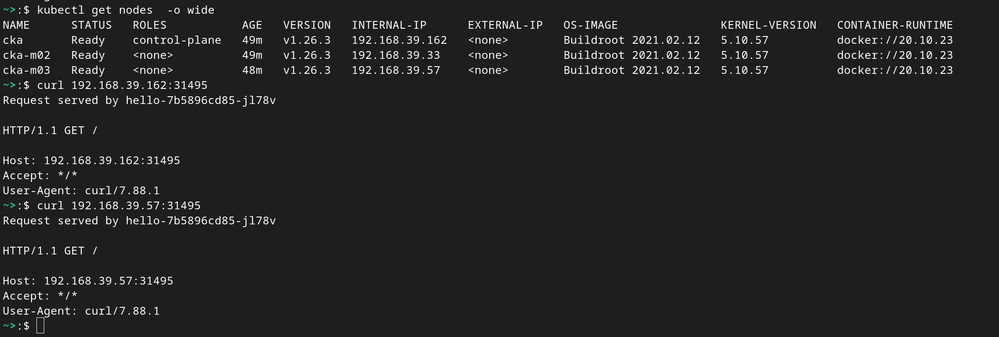

# minikube with libvirt install, working with minikube

for Running k8s locally , we need to install kubectl and minikube
minikube run in a vm, if we are already using kvm for virtualization
we can use kvm as driver ,  we don't need virtualbox or docker.  

## Instruction to use minikube with libvirt


## 1. minikube download & install

Instructions can be found here 
https://minikube.sigs.k8s.io/docs/start/

Download 

```
curl -LO https://storage.googleapis.com/minikube/releases/latest/minikube-linux-amd64
```

Install

```
sudo install minikube-linux-amd64 /usr/local/bin/minikube
```

Check minikube is working 

```
minikube version
```

Sample output




## 2. kubectl download & Install

Official Instructions are here https://kubernetes.io/docs/tasks/tools/install-kubectl-linux/

kubectl is binary , install is simple download and adding to path.

to download latest stable release of kubectl

```
curl -LO "https://dl.k8s.io/release/$(curl -L -s https://dl.k8s.io/release/stable.txt)/bin/linux/amd64/kubectl"
```

to download specific version of kubectl replace 

$(curl -L -s https://dl.k8s.io/release/stable.txt) with  required version , e.g  v 1.27.3
then command to download will be 

```
curl -LO "https://dl.k8s.io/release/v1.27.3/bin/linux/amd64/kubectl"
```

Validate kubectl binary

download checksum file

```
curl -LO "https://dl.k8s.io/$(curl -L -s https://dl.k8s.io/release/stable.txt)/bin/linux/amd64/kubectl.sha256"
```

Validate against checksum file 

```
echo "$(cat kubectl.sha256)  kubectl" | sha256sum --check
```

Output should be 

kubectl: OK

if not re-download and validate again.

Install kubectl

If you have root access , then 

```
sudo install -o root -g root -m 0755 kubectl /usr/local/bin/kubectl
```

If you don't have root access then 

```
chmod +x kubectl
mkdir -p ~/.local/bin
mv ./kubectl ~/.local/bin/kubectl
```

then append ~/.local/bin  to PATH in .bashrc  or bash_profile file

Validate kubectl is working 

```
kubectl version --client --output yaml
```

you should see similar output




## 3. Install kvm

See here for instructions [KVM / Libvirt install](../libvirt-kvm/README.md)  

## 4. Configure minikube to use kvm2 driver

with below command we can ask minikube to use kvm2 as driver 

```
minikube config set driver kvm2
```

## 5. start minikube cluster 

here I want to create a multi node minikube cluster with 3 nodes .

before creating cluster disable any firewall rules that prevent from access the internet from newly going to create k8s nodes.

for example ,  if you running ufw rules , just make sure enable traffic from vm's , otherwise you will see error like below while creating minikube cluster 

*This VM is having trouble accessing https://registry.k8s.io*


create minikube cluster 

```
minikube start --nodes 3 --profile cka
```

above command will create a 3 node minikube cluster as profile name cka.

here is the output 




## 6. check you can access minikube k8s cluster

First check the k8s nodes ( vm) are running 

```
export LIBVIRT_DEFAULT_URI='qemu:///system' 
```

list the vm's

```
virsh list --all
```

here is the output of vm's running status.




Check k8s cluster nodes are  running 

```
kubectl get nodes
```

Output



You can also  try all k8s systems pods , services and deployments are working and running 

```
kubectl get all -A
```

above command try to list all resources from all namespaces.

Try creating simple deployment to test everything is working fine.


```
kubectl create deployment hello --image=kicbase/echo-server:1.0
```
check deployment is created 


Expose the deployment on node port 8080

```
kubectl expose deployment hello --type=NodePort --port=8080
```
check service is created 




Access the app on any node using curl

you can see from service output that service hello is exposed application port 8080 on the node on port 31495.

you can get the nodes ips addresses , and then use curl to access the application as shown below.


